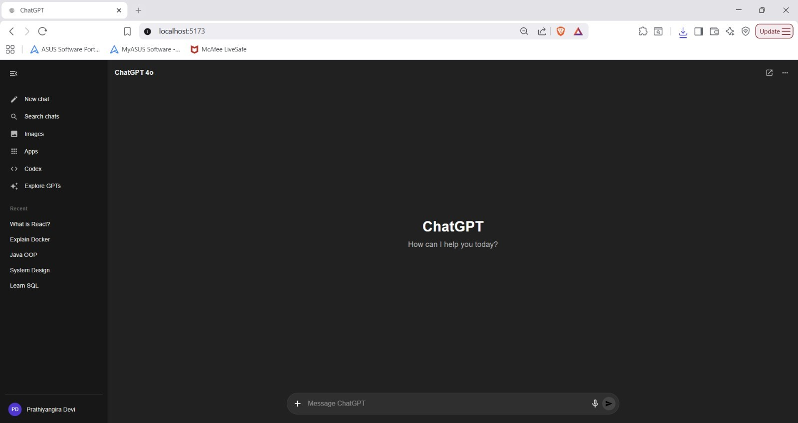
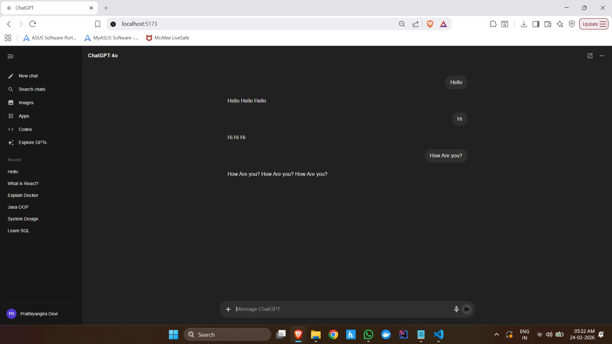
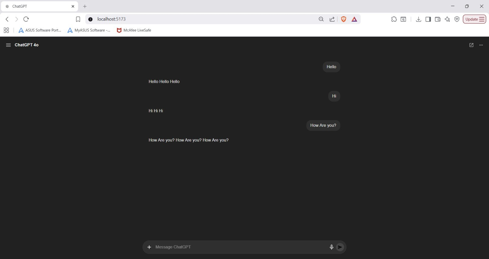
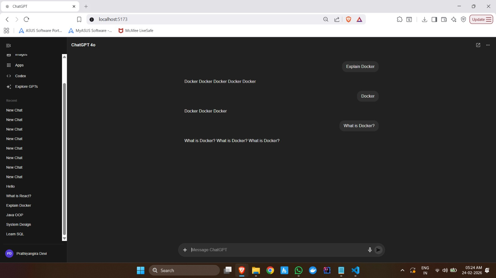

# ChatGPT-4o UI Clone

A high-fidelity frontend replica of the ChatGPT-4o interface built with React and Material UI. This project focuses on achieving a pixel-perfect dark-mode aesthetic, custom sidebar transitions, and a clean, centered landing state.

---

## 🚀 Technical Highlights

- **Fresh Landing State:** The application initializes with a centered "ChatGPT" branding view. When a user starts typing, the layout shifts dynamically to the chat history view.
- **Custom Sidebar Logic:**
  - **Pinned Layout:** "New Chat" is pinned to the top of the menu list, while "Explore GPTs" is pinned to the bottom.
  - **Collapsible Drawer:** Implemented a smooth sliding transition that toggles via the header menu icon when the sidebar is hidden.
- **Prompt Engineering (UI):** Custom CSS overrides on MUI `TextField` to remove focus underlines and force white text rendering for a native-app feel.
- **Demo Bot Logic:** Integrated a custom response handler that repeats user input 3 times to simulate message processing.
- **User Identity:** Personalized sidebar footer with a custom avatar and the name **Prathiyangira Devi**.

---

## 🛠️ Tech Stack

| Layer | Technology |
|-------|------------|
| Framework | React (Vite) |
| UI Library | Material UI (MUI) |
| Icons | Material Icons |
| Styling | Emotion & CSS3 |

---

## 📸 Interface Preview

### 1. Fresh Landing Page
*What you see on initial load: Centered branding and a clean workspace.*



### 2. Initiate Conversation



### 3. Toggle Sidebar



### 4. Scrollable Sidebar with Recent Chats




### 5. Initiate Conversation in a Recent Chat


---

## 🏁 Getting Started

**1. Clone the repo:**
```bash
git clone https://github.com/prathiyangira25/chatgpt-clone.git
cd chatgpt-clone
```

**2. Install dependencies:**
```bash
npm install
```

**3. Launch the development server:**
```bash
npm run dev
```

---

## 📝 Implementation Notes

To modify the bot's repetition behavior, navigate to `ChatWindow.jsx` and locate the `send` function. The response logic follows this pattern:

$$\text{Response} = \text{Input} \times 3$$

That is, the bot echoes the user's input three times as its reply. Adjust the multiplier or replace the logic in that function to customize bot behavior.

---

## 📄 License

This project is developed for educational and portfolio purposes.